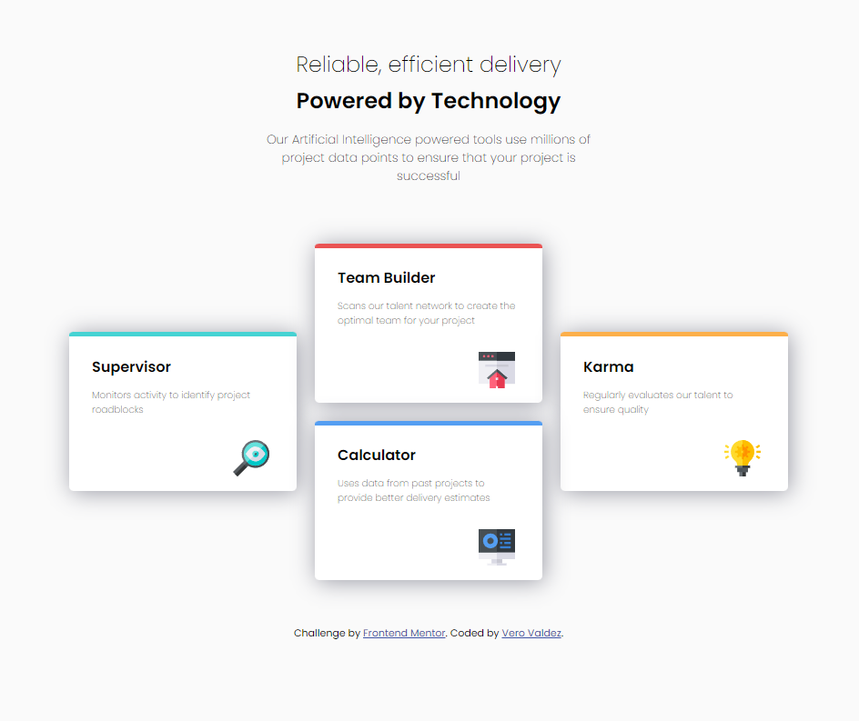
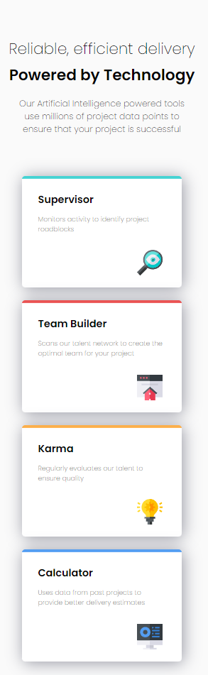

# Frontend Mentor - Four card feature section solution

This is a solution to the [Four card feature section challenge on Frontend Mentor](https://www.frontendmentor.io/challenges/four-card-feature-section-weK1eFYK). Frontend Mentor challenges help you improve your coding skills by building realistic projects. 

## Table of contents

- [Overview](#overview)
  - [The challenge](#the-challenge)
  - [Screenshot](#screenshot)
  - [Links](#links)
- [My process](#my-process)
  - [Built with](#built-with)
  - [What I learned](#what-i-learned)
  - [Useful resources](#useful-resources)
- [Author](#author)
- [Acknowledgments](#acknowledgments)

**Note: Delete this note and update the table of contents based on what sections you keep.**

## Overview

### The challenge

Users should be able to:

- View the optimal layout for the site depending on their device's screen size

### Screenshot




### Links

- Solution URL: [https://github.com/veronicajujuy/Four-card-feature](https://github.com/veronicajujuy/Four-card-feature)
- Live Site URL: [https://four-card-feature-eta-five.vercel.app/](https://four-card-feature-eta-five.vercel.app/)

## My process

### Built with

- Semantic HTML5 markup
- CSS custom properties
- Flexbox
- CSS Grid
- Mobile-first workflow


### What I learned

I learned how to use css grid


```css
@media (min-width: 400px) {
    main {
    margin: 0 auto;
    display: grid;
    grid-template-areas:
      ". two ."
      "one two three"
      "one four three"
      ". four .";
    gap: 20px;
    grid-template-columns: 1fr 1fr 1fr;
    grid-template-rows: 1fr 1fr 1fr 1fr;
    inline-size: 80%;
    justify-items: center;
  }
}
```


### Useful resources

- [Example resource 1](https://www.youtube.com/watch?v=KByjJafoTEw) - This helped me for CSS Grid

## Author

- Frontend Mentor - [@veronicajujuy](https://www.frontendmentor.io/profile/veronicajujuy)
